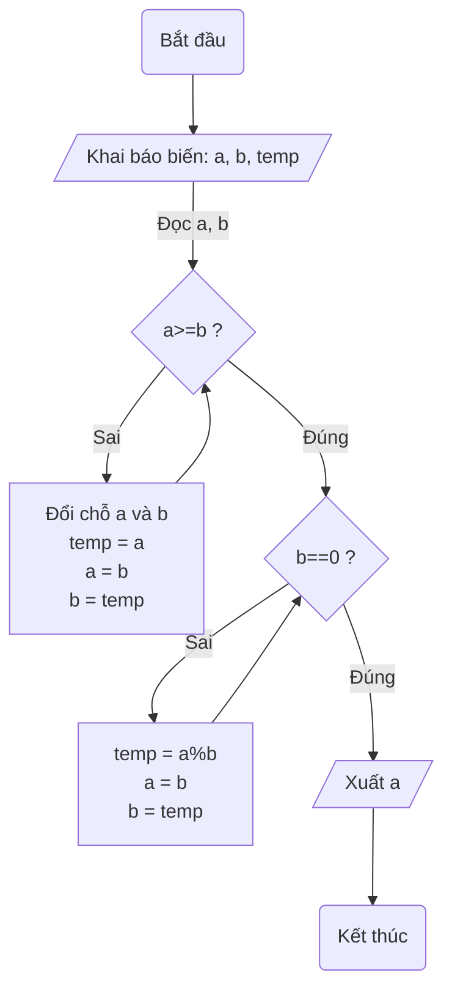
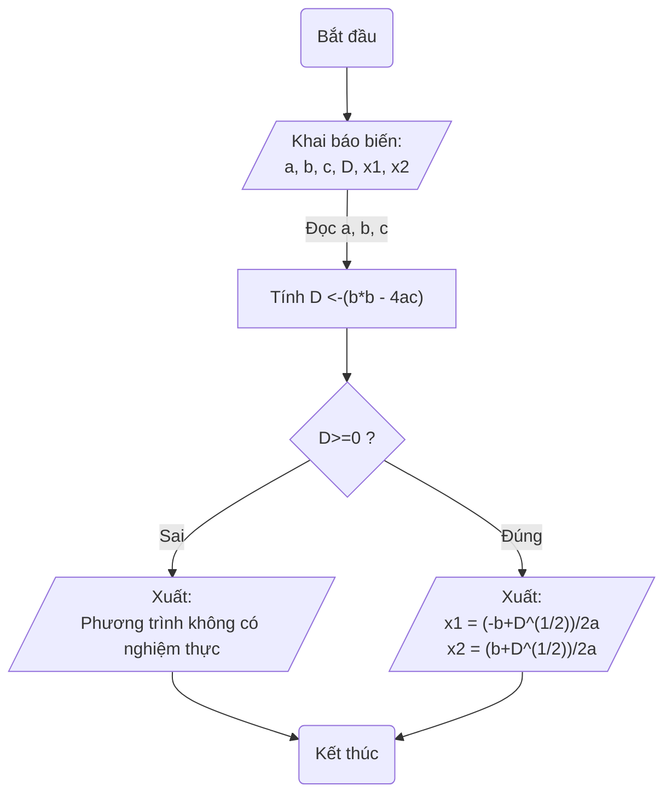
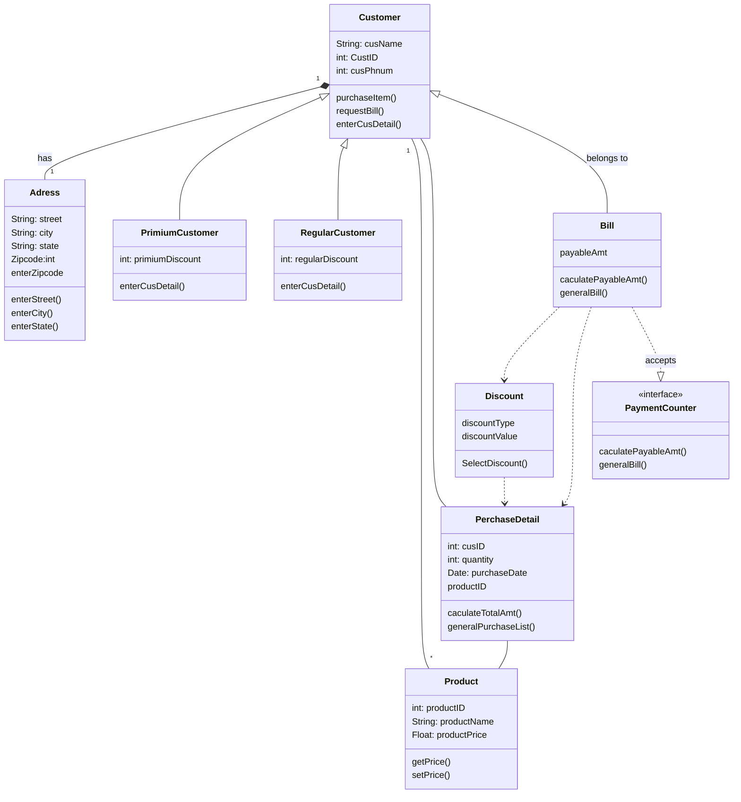
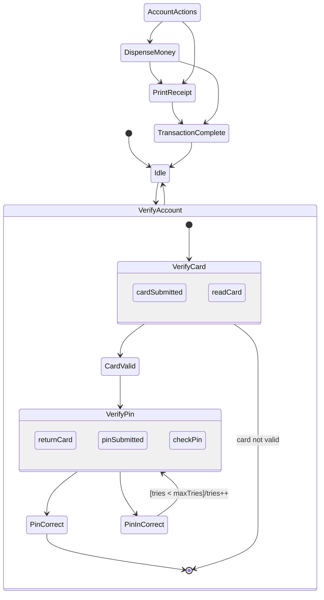

# Bài tập thực hành Mermaid, Markdown

> Môn học: Thiết kế phần mềm
> Lớp: 17_12
> Khoa: Công nghệ thông tin
> Giáo viên hướng dẫn: Ngô Ngọc Đăng Khoa

# :man: Danh sách thành viên

| Họ tên           |  Mssv   |
|:---------------- |:-------:|
| Trương Văn Tú    | 1712863 |
| Nguyễn Mạnh Tuấn | 1712875 |
| Nguyễn Trí Vinh  | 1712875 |

# :memo: Bài làm
## Seminar #1 - Mermaid
### tags: TKPM-Mermaid
## Cú pháp Mermaid
    https://mermaid-js.github.io/mermaid/#/    
## Luyện tập
### Câu 1: Flow chart
#### Ước chung lớn nhất

[](https://mermaid-js.github.io/mermaid-live-editor/#/edit/eyJjb2RlIjoiZ3JhcGggVERcbiAgICBTKELhuq90IMSR4bqndSkgLS0-IEFbL0toYWkgYsOhbyBiaeG6v246IGEsIGIsIHRlbXAvXVxuICAgIEEtLT58xJDhu41jIGEsIGJ8IEJ7YT49YiA_fVxuICAgIEItLT58U2FpfCBEW1wixJDhu5VpIGNo4buXIGEgdsOgIGI8YnIvPnRlbXAgPSBhPGJyLz5hID0gYjxici8-YiA9ICAgICAgICAgICB0ZW1wXCJdXG4gICAgRC0tPkJcbiAgICBCLS0-fMSQw7puZ3wgQ3tiPT0wID99XG4gICAgQy0tPnxTYWl8IEVbdGVtcCA9IGElYjxici8-YSA9IGI8YnIvPmIgPSB0ZW1wXSAtLT4gQ1xuICAgIEMtLT58xJDDum5nfCBGWy9YdeG6pXQgYS9dXG4gICAgRi0tPkcoS-G6v3QgdGjDumMpXG5cdFx0XHRcdFx0IiwibWVybWFpZCI6eyJ0aGVtZSI6ImRlZmF1bHQifSwidXBkYXRlRWRpdG9yIjpmYWxzZX0)
#### Giải phương trình bậc 2

[](https://mermaid-js.github.io/mermaid-live-editor/#/edit/eyJjb2RlIjoiZ3JhcGggVERcbiAgICBTKELhuq90IMSR4bqndSkgLS0-IEFbL0toYWkgYsOhbyBiaeG6v246PGJyLz5hLCBiLCBjLCBELCB4MSwgeDIvXVxuICAgIEEtLT58xJDhu41jIGEsIGIsIGN8IEJbXCJUw61uaCBEIDwtKGIqYiAtIDRhYylcIl1cblx0QiAtLT4gQ3tEPj0wID99XG5cdEMgLS0-fMSQw7puZ3wgRFsvXCJYdeG6pXQ6PGJyLz54MSA9ICgtYitEXigxLzIpKS8yYTxici8-eDIgPSAgICAgICAgICAgICAoYitEXigxLzIpKS8yYVwiL11cblx0QyAtLT58U2FpfCBFWy9cIlh14bqldDo8YnIvPlBoxrDGoW5nIHRyw6xuaCBraMO0bmcgY8OzIG5naGnhu4dtIHRo4buxY1wiL11cbiAgICBFICYgRCAtLT4gRihL4bq_dCB0aMO6YykgXG5cdFx0XHRcdFx0IiwibWVybWFpZCI6eyJ0aGVtZSI6ImRlZmF1bHQifSwidXBkYXRlRWRpdG9yIjpmYWxzZX0)

## Câu 2: Class diagrams

[![](https://mermaid.ink/img/eyJjb2RlIjoiY2xhc3NEaWFncmFtXG4gICAgQ3VzdG9tZXIgXCIxXCIgKi0tIFwiMVwiIEFkcmVzczpoYXNcbiAgICBDdXN0b21lciA8fC0tIFByaW1pdW1DdXN0b21lclxuICAgIEN1c3RvbWVyIDx8LS0gUmVndWxhckN1c3RvbWVyXG4gICAgQ3VzdG9tZXIgXCIxXCIgLS0gXCIqXCIgUHJvZHVjdFxuICAgIEN1c3RvbWVyIC0tIFBlcmNoYXNlRGV0YWlsXG4gICAgQ3VzdG9tZXIgPHwtLSBCaWxsIDogYmVsb25ncyB0b1xuICAgIFBlcmNoYXNlRGV0YWlsIC0tIFByb2R1Y3RcbiAgICBEaXNjb3VudCAuLj4gUGVyY2hhc2VEZXRhaWxcbiAgICBCaWxsIC4uPiBEaXNjb3VudFxuICAgIEJpbGwgLi4-IFBlcmNoYXNlRGV0YWlsXG4gICAgQmlsbCAuLnw-IFBheW1lbnRDb3VudGVyIDphY2NlcHRzXG4gICAgXG5cdGNsYXNzIEN1c3RvbWVye1xuXHRTdHJpbmc6IGN1c05hbWVcbiAgICBpbnQ6IEN1c3RJRFxuICAgIGludDogY3VzUGhudW1cbiAgICBwdXJjaGFzZUl0ZW0oKVxuICAgIHJlcXVlc3RCaWxsKClcbiAgICBlbnRlckN1c0RldGFpbCgpXG5cdH1cblx0Y2xhc3MgUHJpbWl1bUN1c3RvbWVye1xuXHRcdGludDogcHJpbWl1bURpc2NvdW50XG5cdFx0ZW50ZXJDdXNEZXRhaWwoKVxuXHR9XG5cdGNsYXNzIFJlZ3VsYXJDdXN0b21lcntcblx0XHRpbnQ6IHJlZ3VsYXJEaXNjb3VudFxuXHRcdGVudGVyQ3VzRGV0YWlsKClcblx0fVxuICAgIGNsYXNzIEFkcmVzcyB7XG4gICAgICBTdHJpbmc6IHN0cmVldFxuICAgICAgU3RyaW5nOiBjaXR5XG4gICAgICBTdHJpbmc6IHN0YXRlXG4gICAgICBaaXBjb2RlOmludFxuICAgICAgZW50ZXJTdHJlZXQoKVxuICAgICAgZW50ZXJDaXR5KClcbiAgICAgIGVudGVyU3RhdGUoKVxuICAgICAgZW50ZXJaaXBjb2RlXG4gICAgfVxuICAgIGNsYXNzIFByb2R1Y3R7XG4gICAgICAgIGludDogcHJvZHVjdElEXG4gICAgICAgIFN0cmluZzogcHJvZHVjdE5hbWVcbiAgICAgICAgRmxvYXQ6IHByb2R1Y3RQcmljZVxuICAgICAgICBnZXRQcmljZSgpXG4gICAgICAgIHNldFByaWNlKClcbiAgICB9XG4gICAgY2xhc3MgUGVyY2hhc2VEZXRhaWx7XG4gICAgICAgIGludDogY3VzSURcbiAgICAgICAgaW50OiBxdWFudGl0eVxuICAgICAgICBEYXRlOiBwdXJjaGFzZURhdGVcbiAgICAgICAgcHJvZHVjdElEXG4gICAgICAgIGNhY3VsYXRlVG90YWxBbXQoKVxuICAgICAgICBnZW5lcmFsUHVyY2hhc2VMaXN0KClcbiAgICB9XG4gICAgY2xhc3MgRGlzY291bnR7XG4gICAgICAgIGRpc2NvdW50VHlwZVxuICAgICAgICBkaXNjb3VudFZhbHVlXG4gICAgICAgIFNlbGVjdERpc2NvdW50KClcbiAgICB9XG4gICAgY2xhc3MgQmlsbHtcbiAgICAgICAgcGF5YWJsZUFtdFxuICAgICAgICBjYWN1bGF0ZVBheWFibGVBbXQoKVxuICAgICAgICBnZW5lcmFsQmlsbCgpXG4gICAgfVxuICAgIGNsYXNzIFBheW1lbnRDb3VudGVye1xuICAgICAgICA8PGludGVyZmFjZT4-XG4gICAgICAgIGNhY3VsYXRlUGF5YWJsZUFtdCgpXG4gICAgICAgIGdlbmVyYWxCaWxsKClcbiAgICB9IiwibWVybWFpZCI6eyJ0aGVtZSI6ImRlZmF1bHQifSwidXBkYXRlRWRpdG9yIjpmYWxzZX0)](https://mermaid-js.github.io/mermaid-live-editor/#/edit/eyJjb2RlIjoiY2xhc3NEaWFncmFtXG4gICAgQ3VzdG9tZXIgXCIxXCIgKi0tIFwiMVwiIEFkcmVzczpoYXNcbiAgICBDdXN0b21lciA8fC0tIFByaW1pdW1DdXN0b21lclxuICAgIEN1c3RvbWVyIDx8LS0gUmVndWxhckN1c3RvbWVyXG4gICAgQ3VzdG9tZXIgXCIxXCIgLS0gXCIqXCIgUHJvZHVjdFxuICAgIEN1c3RvbWVyIC0tIFBlcmNoYXNlRGV0YWlsXG4gICAgQ3VzdG9tZXIgPHwtLSBCaWxsIDogYmVsb25ncyB0b1xuICAgIFBlcmNoYXNlRGV0YWlsIC0tIFByb2R1Y3RcbiAgICBEaXNjb3VudCAuLj4gUGVyY2hhc2VEZXRhaWxcbiAgICBCaWxsIC4uPiBEaXNjb3VudFxuICAgIEJpbGwgLi4-IFBlcmNoYXNlRGV0YWlsXG4gICAgQmlsbCAuLnw-IFBheW1lbnRDb3VudGVyIDphY2NlcHRzXG4gICAgXG5cdGNsYXNzIEN1c3RvbWVye1xuXHRTdHJpbmc6IGN1c05hbWVcbiAgICBpbnQ6IEN1c3RJRFxuICAgIGludDogY3VzUGhudW1cbiAgICBwdXJjaGFzZUl0ZW0oKVxuICAgIHJlcXVlc3RCaWxsKClcbiAgICBlbnRlckN1c0RldGFpbCgpXG5cdH1cblx0Y2xhc3MgUHJpbWl1bUN1c3RvbWVye1xuXHRcdGludDogcHJpbWl1bURpc2NvdW50XG5cdFx0ZW50ZXJDdXNEZXRhaWwoKVxuXHR9XG5cdGNsYXNzIFJlZ3VsYXJDdXN0b21lcntcblx0XHRpbnQ6IHJlZ3VsYXJEaXNjb3VudFxuXHRcdGVudGVyQ3VzRGV0YWlsKClcblx0fVxuICAgIGNsYXNzIEFkcmVzcyB7XG4gICAgICBTdHJpbmc6IHN0cmVldFxuICAgICAgU3RyaW5nOiBjaXR5XG4gICAgICBTdHJpbmc6IHN0YXRlXG4gICAgICBaaXBjb2RlOmludFxuICAgICAgZW50ZXJTdHJlZXQoKVxuICAgICAgZW50ZXJDaXR5KClcbiAgICAgIGVudGVyU3RhdGUoKVxuICAgICAgZW50ZXJaaXBjb2RlXG4gICAgfVxuICAgIGNsYXNzIFByb2R1Y3R7XG4gICAgICAgIGludDogcHJvZHVjdElEXG4gICAgICAgIFN0cmluZzogcHJvZHVjdE5hbWVcbiAgICAgICAgRmxvYXQ6IHByb2R1Y3RQcmljZVxuICAgICAgICBnZXRQcmljZSgpXG4gICAgICAgIHNldFByaWNlKClcbiAgICB9XG4gICAgY2xhc3MgUGVyY2hhc2VEZXRhaWx7XG4gICAgICAgIGludDogY3VzSURcbiAgICAgICAgaW50OiBxdWFudGl0eVxuICAgICAgICBEYXRlOiBwdXJjaGFzZURhdGVcbiAgICAgICAgcHJvZHVjdElEXG4gICAgICAgIGNhY3VsYXRlVG90YWxBbXQoKVxuICAgICAgICBnZW5lcmFsUHVyY2hhc2VMaXN0KClcbiAgICB9XG4gICAgY2xhc3MgRGlzY291bnR7XG4gICAgICAgIGRpc2NvdW50VHlwZVxuICAgICAgICBkaXNjb3VudFZhbHVlXG4gICAgICAgIFNlbGVjdERpc2NvdW50KClcbiAgICB9XG4gICAgY2xhc3MgQmlsbHtcbiAgICAgICAgcGF5YWJsZUFtdFxuICAgICAgICBjYWN1bGF0ZVBheWFibGVBbXQoKVxuICAgICAgICBnZW5lcmFsQmlsbCgpXG4gICAgfVxuICAgIGNsYXNzIFBheW1lbnRDb3VudGVye1xuICAgICAgICA8PGludGVyZmFjZT4-XG4gICAgICAgIGNhY3VsYXRlUGF5YWJsZUFtdCgpXG4gICAgICAgIGdlbmVyYWxCaWxsKClcbiAgICB9IiwibWVybWFpZCI6eyJ0aGVtZSI6ImRlZmF1bHQifSwidXBkYXRlRWRpdG9yIjpmYWxzZX0)
## Câu 3: Sequence diagrams
## Câu 4: State diagrams

[![](https://mermaid.ink/img/eyJjb2RlIjoic3RhdGVEaWFncmFtXG4gICAgWypdIC0tPiBJZGxlXG4gICAgQWNjb3VudEFjdGlvbnMgLS0-IERpc3BlbnNlTW9uZXlcbiAgICBEaXNwZW5zZU1vbmV5IC0tPiBQcmludFJlY2VpcHRcbiAgICBBY2NvdW50QWN0aW9ucyAtLT4gUHJpbnRSZWNlaXB0XG5cbiAgICBQcmludFJlY2VpcHQgLS0-IFRyYW5zYWN0aW9uQ29tcGxldGVcbiAgICBEaXNwZW5zZU1vbmV5IC0tPiBUcmFuc2FjdGlvbkNvbXBsZXRlXG4gICAgVHJhbnNhY3Rpb25Db21wbGV0ZSAtLT4gSWRsZVxuXG4gICAgSWRsZSAtLT4gVmVyaWZ5QWNjb3VudFxuICAgIHN0YXRlIFZlcmlmeUFjY291bnQge1xuICAgICAgICBzdGF0ZSBWZXJpZnlDYXJkIHtcbiAgICAgICAgICAgIGNhcmRTdWJtaXR0ZWRcbiAgICAgICAgICAgIHJlYWRDYXJkXG4gICAgICAgICAgICByZXR1cm5DYXJkXG4gICAgICAgIH1cbiAgICAgICAgc3RhdGUgVmVyaWZ5UGluIHtcbiAgICAgICAgICAgIHBpblN1Ym1pdHRlZFxuICAgICAgICAgICAgY2hlY2tQaW5cbiAgICAgICAgICAgIHJldHVybkNhcmRcbiAgICAgICAgfVxuICAgICAgICBbKl0gLS0-IFZlcmlmeUNhcmRcbiAgICAgICAgVmVyaWZ5Q2FyZCAtLT4gWypdIDogY2FyZCBub3QgdmFsaWRcbiAgICAgICAgVmVyaWZ5Q2FyZCAtLT4gQ2FyZFZhbGlkXG4gICAgICAgIENhcmRWYWxpZCAtLT4gVmVyaWZ5UGluXG4gICAgICAgIFZlcmlmeVBpbiAtLT4gUGluQ29ycmVjdFxuICAgICAgICBQaW5Db3JyZWN0IC0tPiBbKl1cbiAgICAgICAgVmVyaWZ5UGluIC0tPiBQaW5JbkNvcnJlY3RcbiAgICAgICAgUGluSW5Db3JyZWN0IC0tPiBWZXJpZnlQaW46IFt0cmllcyA8IG1heFRyaWVzXS90cmllcysrXG4gICAgfVxuICAgIFZlcmlmeUFjY291bnQgLS0-IElkbGUiLCJtZXJtYWlkIjp7InRoZW1lIjoiZGVmYXVsdCJ9LCJ1cGRhdGVFZGl0b3IiOmZhbHNlfQ)](https://mermaid-js.github.io/mermaid-live-editor/#/edit/eyJjb2RlIjoic3RhdGVEaWFncmFtXG4gICAgWypdIC0tPiBJZGxlXG4gICAgQWNjb3VudEFjdGlvbnMgLS0-IERpc3BlbnNlTW9uZXlcbiAgICBEaXNwZW5zZU1vbmV5IC0tPiBQcmludFJlY2VpcHRcbiAgICBBY2NvdW50QWN0aW9ucyAtLT4gUHJpbnRSZWNlaXB0XG5cbiAgICBQcmludFJlY2VpcHQgLS0-IFRyYW5zYWN0aW9uQ29tcGxldGVcbiAgICBEaXNwZW5zZU1vbmV5IC0tPiBUcmFuc2FjdGlvbkNvbXBsZXRlXG4gICAgVHJhbnNhY3Rpb25Db21wbGV0ZSAtLT4gSWRsZVxuXG4gICAgSWRsZSAtLT4gVmVyaWZ5QWNjb3VudFxuICAgIHN0YXRlIFZlcmlmeUFjY291bnQge1xuICAgICAgICBzdGF0ZSBWZXJpZnlDYXJkIHtcbiAgICAgICAgICAgIGNhcmRTdWJtaXR0ZWRcbiAgICAgICAgICAgIHJlYWRDYXJkXG4gICAgICAgICAgICByZXR1cm5DYXJkXG4gICAgICAgIH1cbiAgICAgICAgc3RhdGUgVmVyaWZ5UGluIHtcbiAgICAgICAgICAgIHBpblN1Ym1pdHRlZFxuICAgICAgICAgICAgY2hlY2tQaW5cbiAgICAgICAgICAgIHJldHVybkNhcmRcbiAgICAgICAgfVxuICAgICAgICBbKl0gLS0-IFZlcmlmeUNhcmRcbiAgICAgICAgVmVyaWZ5Q2FyZCAtLT4gWypdIDogY2FyZCBub3QgdmFsaWRcbiAgICAgICAgVmVyaWZ5Q2FyZCAtLT4gQ2FyZFZhbGlkXG4gICAgICAgIENhcmRWYWxpZCAtLT4gVmVyaWZ5UGluXG4gICAgICAgIFZlcmlmeVBpbiAtLT4gUGluQ29ycmVjdFxuICAgICAgICBQaW5Db3JyZWN0IC0tPiBbKl1cbiAgICAgICAgVmVyaWZ5UGluIC0tPiBQaW5JbkNvcnJlY3RcbiAgICAgICAgUGluSW5Db3JyZWN0IC0tPiBWZXJpZnlQaW46IFt0cmllcyA8IG1heFRyaWVzXS90cmllcysrXG4gICAgfVxuICAgIFZlcmlmeUFjY291bnQgLS0-IElkbGUiLCJtZXJtYWlkIjp7InRoZW1lIjoiZGVmYXVsdCJ9LCJ1cGRhdGVFZGl0b3IiOmZhbHNlfQ)

                            Khoa công nghệ thông tin - HCMUS - ĐHQG HCM
